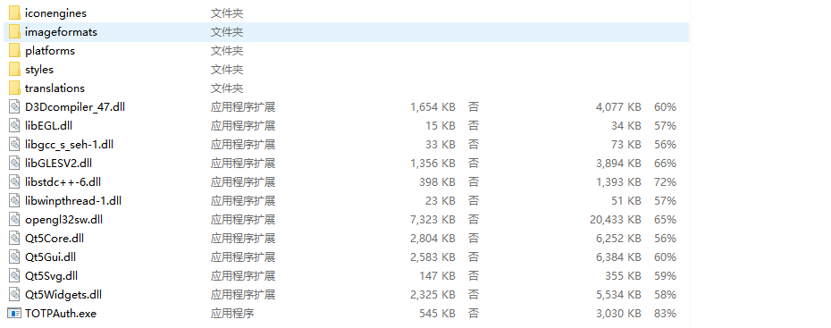
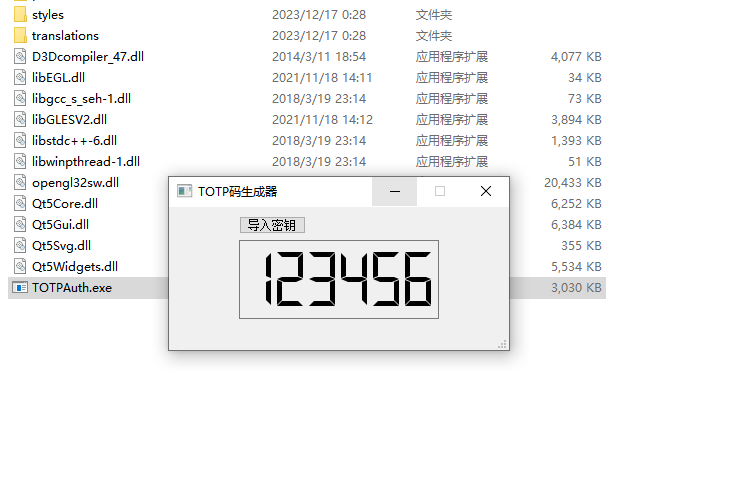
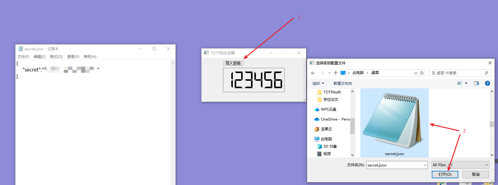

### 环境要求
```txt
cmake >= 3.10
gcc   >= 8.1
```
### 构建项目 && 运行
```shell
git clone --recursive git@github.com:1291945816/hybrid-repo.git
cd ToTpAuth
cmake -B build -S . 
cmake --build build  -j 8
cd build 
./ToTpAuth
```

### 关于release中的`TOTPAuth`小工具介绍

>`TOTPAuth`（中文名为**TOTP码生成器**）是在项目`ToTpAuth`的基础上采用Qt5实现的一个小工具，方便用户在一些需要6位TOTP码的场景下能够及时生成TOTP码。**对于我来说，目前的场景就是Github上的两步认证，虽然之前写了项目`ToTpAuth`，但我不想每次都要跑一下代码才能获取结果。**

#### 基本使用

release中提供`TOTPAuth.zip`压缩包，将其解压后即可得到如下形式的文件：



直接双击打开`TOTPAuth.exe`文件，它的界面如下：



在没有导入密钥数据时，会默认显示`123456`，导入密钥仅支持json格式的文件，它的格式内容为：

```json
{
    "secret":"你的密钥数据"
}
```

**所以在导入密钥前，需要准备符合上述格式的一个json文件。**

假设我目前已经有了一个名为`secret.json`的文件，点击**导入密钥**选择文件进行导入：



格式正确的话会显示**导入成功**的提示，然后数字显示那里**会立即显示符合要求的6位TOTP码**。

#### 其他特性

- 支持**密钥信息自动保存**，下次打开该小工具会自动导入上一次的密钥数据


>该工具的源码也在release中提供了，欢迎下载。